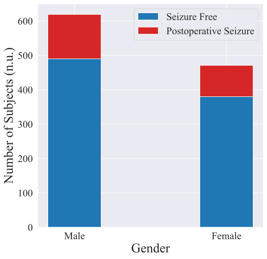
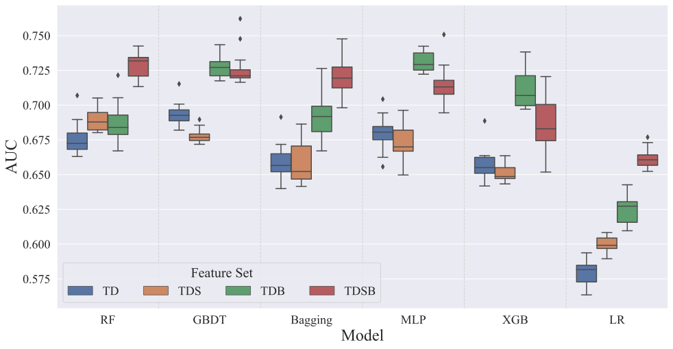
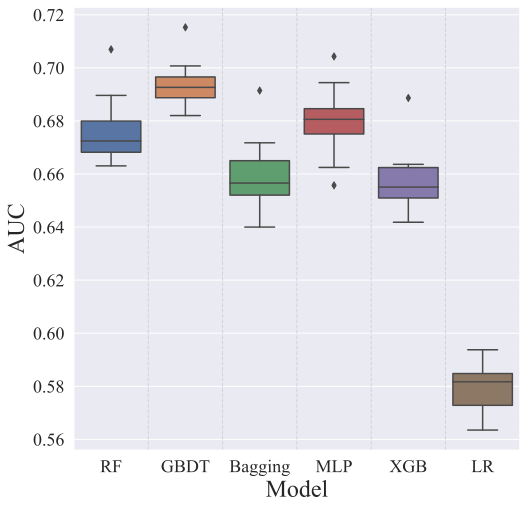
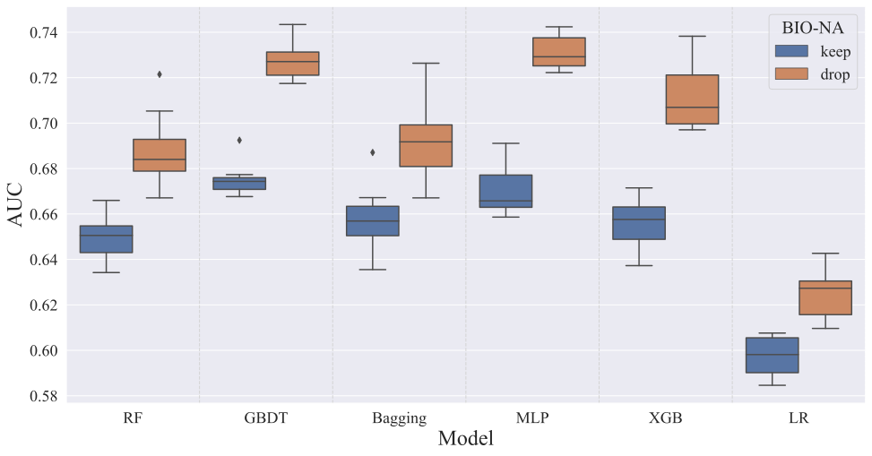
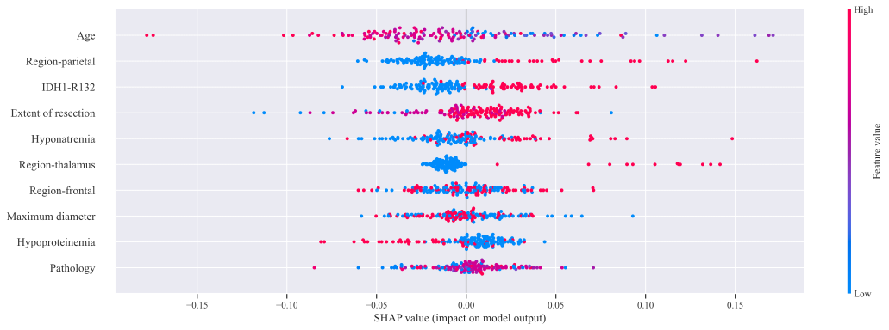
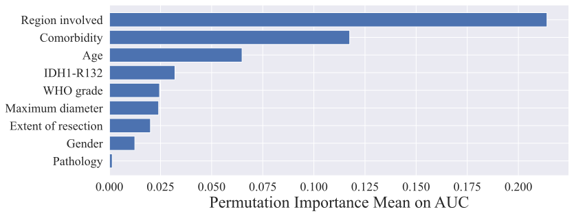
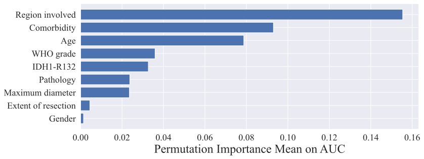

# seizure_prediction

Seizure prediction using clinical data.

This is a copy of a private repository, but **without** the raw data and trained models.

## Data distribution

<details>
<summary>Click to expand!</summary>

  Age distribution         |  Sex distribution
:-------------------------:|:-------------------------:
 | 

:point_right: [Back to top](#seizure_prediction)

</details>

## Models

- Logistic regression
- ~~Support vector classifier~~
- Multi-layer perceptron
- Random forest
- Bagging classifier
- Gradient boosting classifier
- XGBoost classifier

## Grid search

Execute the following command for a complete grid search over all the [models](#models)

```bash
nohup python grid_search.py > /dev/null 2>&1 & echo $! > ./log/gs.pid
```

### Aggregation of all grid search experiments

<details>
<summary>Click to expand!</summary>

  BIO NA drop              |  BIO NA keep
:-------------------------:|:-------------------------:
 | 

:point_right: [Back to top](#seizure_prediction)

</details>

### Aggregation of grid search experiments on different feature sets

<details>
<summary>Click to expand!</summary>

  TD              |  TDS             |  TDB             |  TDSB
:----------------:|:----------------:|:----------------:|:----------------:
 |  |  | 

:point_right: [Back to top](#seizure_prediction)

</details>

## Feature importance analysis

### `SHAP` summary (top 10 features)

<details>
<summary>Click to expand!</summary>



  Violin plot              |  Bar plot
:-------------------------:|:-------------------------:
 | 

:point_right: [Back to top](#seizure_prediction)

</details>

### Permutation importance

<details>
<summary>Click to expand!</summary>

  Run 1                    |  Run 2
:-------------------------:|:-------------------------:
 | 

:point_right: [Back to top](#seizure_prediction)

</details>
