# seizure_prediction

[](https://seizure-prediction.streamlit.app/)

Seizure prediction using clinical data.

[Visualization](images) were done using functions in [`viz.py`](viz.py)

Risk differences analysis were performed with [`diff-binom-confint`](https://pypi.org/project/diff-binom-confint/), which is also hosted on [Github](https://github.com/DeepPSP/DBCI/).

Serving API: http://101.43.135.121:11111/seizure_prediction (POST only)

Online APP: https://seizure-prediction.streamlit.app/ | http://101.43.135.121:8501/

## File/folder description

- [`app`](app) - Streamlit app.
- [`data`](data) - Data folder.
- [`images`](images) - Image folder containing visualizations of the data and experiment results.
- [`nn`](nn) - Model factory for neural networks (mainly MLP).
- [`config.py`](config.py) - Configuration file, including the parameters/hyperparameters for the models.
- [`data_processing.py`](data_processing.py) - Data processing functions.
- [`feature_selection.py`](feature_selection.py) - Feature selection functions.
- [`grid_search.py`](grid_search.py) - Grid search for hyperparameters.
- [`metrics.py`](metrics.py) - Evaluation metrics.
- [`models.py`](models.py) - Model factory for non-neural network models.
- [`risk_diff.py`](risk_diff.py) - Binomial risk difference analysis.
- [`service.py`](service.py) - Flask service for serving the model.
- [`utils.py`](utils.py) - Utility functions.
- [`viz.py`](viz.py) - Visualization functions.

There are also docker files for building the containers for different purposes, and requirements files along with them.

## Data distribution

<details>
<summary>Click to expand!</summary>

  Age distribution         |  Gender distribution
:-------------------------:|:-------------------------:
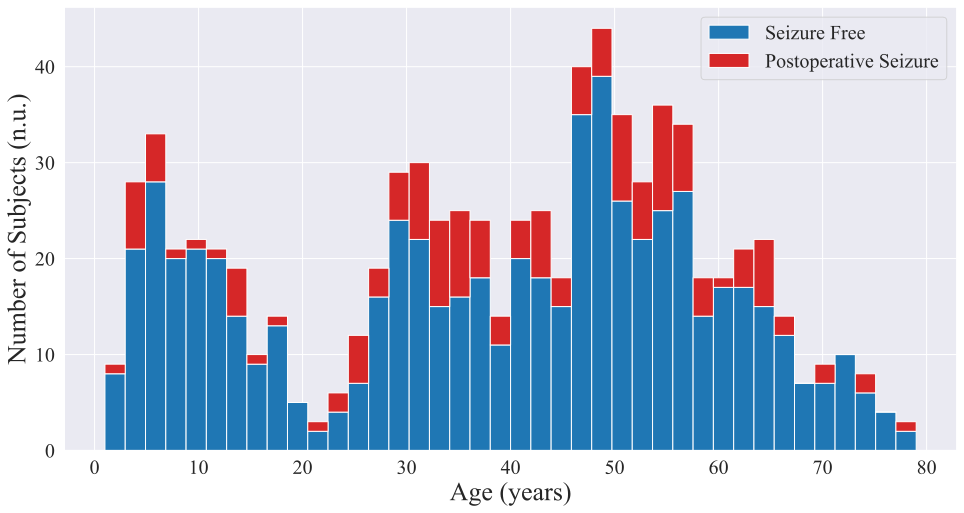 | 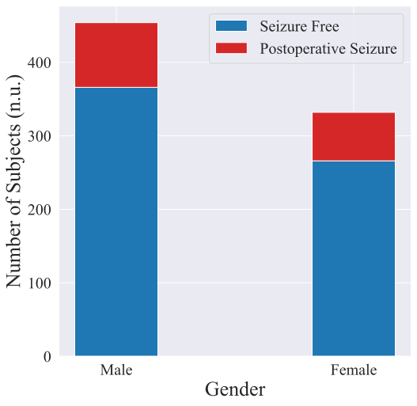

:point_right: [Back to top](#seizure_prediction)

</details>

## Models

- Logistic regression
- Support vector classifier
- Multi-layer perceptron
- Random forest
- Bagging classifier
- Gradient boosting classifier
- XGBoost classifier

### ROC of one typical experiment

<details>
<summary>Click to expand!</summary>

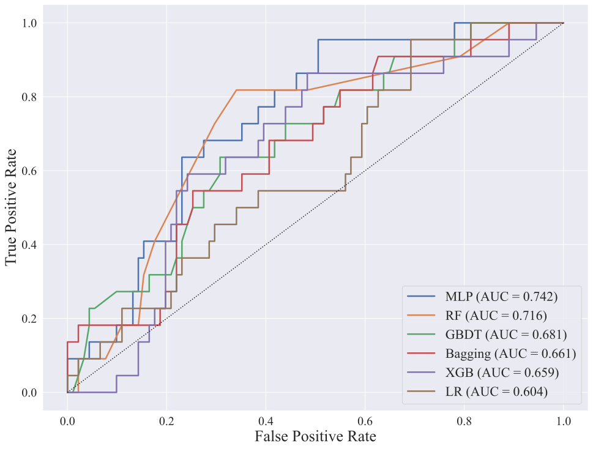

:point_right: [Back to top](#seizure_prediction)

</details>

## Grid search

Execute the following command for a complete grid search over all the [models](#models)

```bash
nohup python grid_search.py -n 10 > /dev/null 2>&1 & echo $! > ./log/gs.pid
```

### Aggregation of all grid search experiments

<details>
<summary>Click to expand!</summary>

  BIO NA drop              |  BIO NA keep
:-------------------------:|:-------------------------:
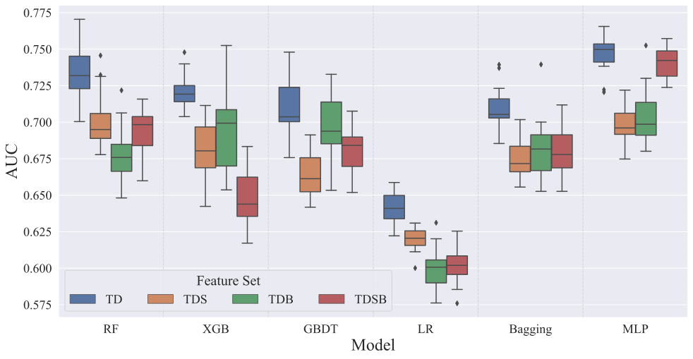 | 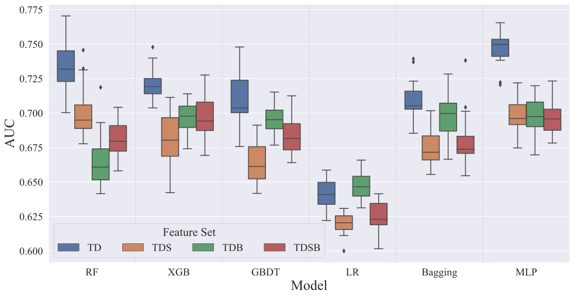

:point_right: [Back to top](#seizure_prediction)

</details>

### Aggregation of grid search experiments on different feature sets

<details>
<summary>Click to expand!</summary>

  TD              |  TDS             |  TDB             |  TDSB
:----------------:|:----------------:|:----------------:|:----------------:
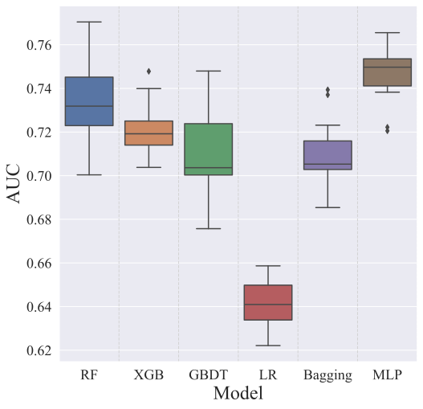 | 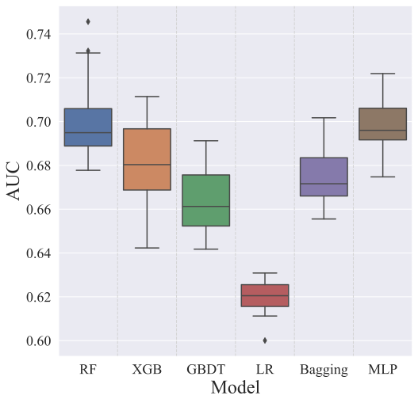 | 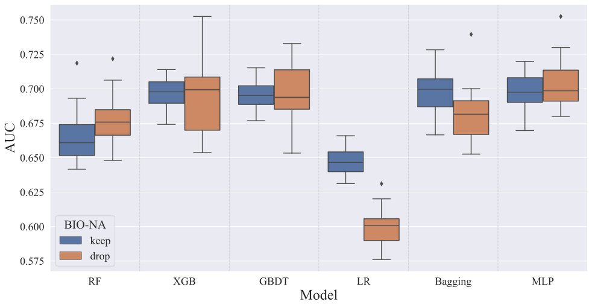 | 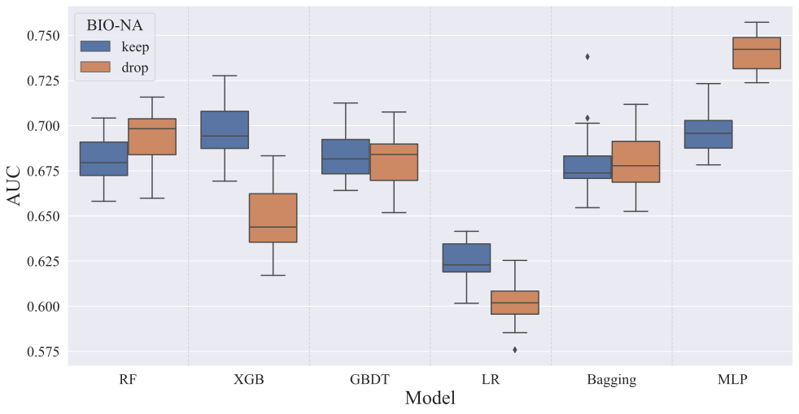

:point_right: [Back to top](#seizure_prediction)

</details>

## Feature importance analysis

### `SHAP` summary (top 10 features)

<details>
<summary>Click to expand!</summary>

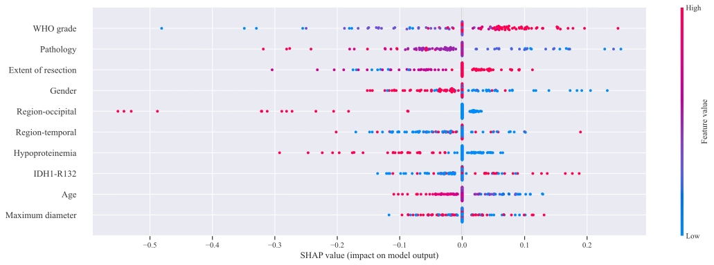

  Violin plot              |  Bar plot
:-------------------------:|:-------------------------:
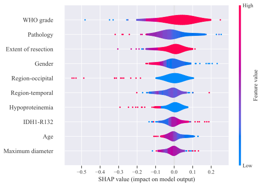 | 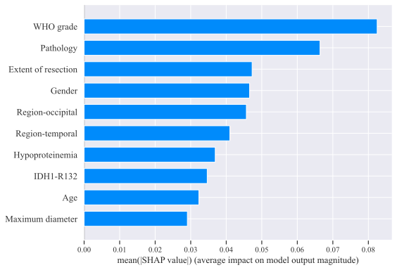
:point_right: [Back to top](#seizure_prediction)

</details>

### Permutation importance

<details>
<summary>Click to expand!</summary>

  Run 1                    |  Run 2
:-------------------------:|:-------------------------:
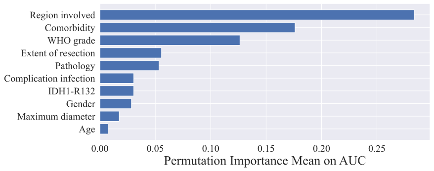 | 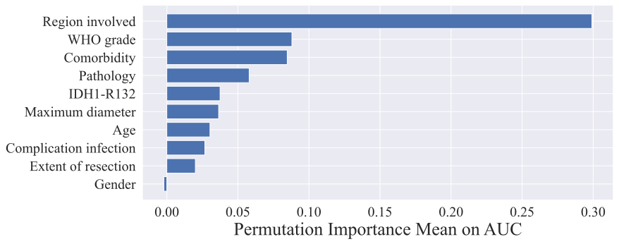

:point_right: [Back to top](#seizure_prediction)

</details>
